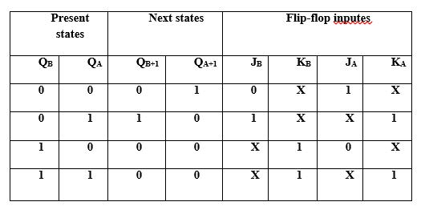
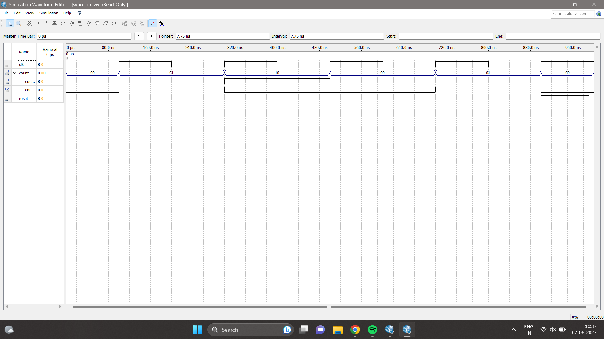
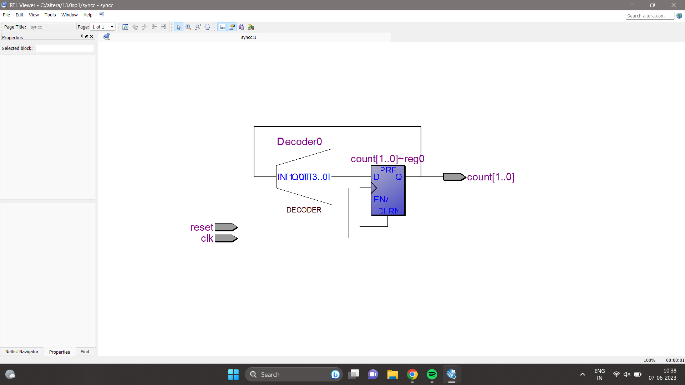

### Simulation-project--Digital-Electronics
# TITLE
Design and simulate mod 3 synchronous counter with JK flip flop using Verilog.

# THEORY
 A mod 3 synchronous counter is a digital circuit that counts in modulo-3 sequence, meaning it counts from 0 to 2 and then resets to 0. This type of counter is commonly implemented using JK flip-flops.
# LOGIC DIAGRAM:

### PROCEDURE:
we have a module called "Mod3Counter" with inputs "clk" (clock) and "reset", and an output "count" of 3 bits representing the counter value.

The counter is implemented using a synchronous always block, which triggers on the positive edge of the clock signal or the positive edge of the reset signal.

Inside the always block, we have a case statement that checks the current value of the "count" register and updates it accordingly. When the reset signal is active (high), the counter is reset to 0. Otherwise, the counter value is incremented modulo 3, meaning it goes from 0 to 2 and then resets to 0 again.
# PROGRAM:
```
module syncc(clk,reset,count);
  input clk;
  input reset;
  output reg [1:0] count;
  always @(posedge clk or posedge reset) 
  begin
    if (reset)
      count <= 2'b00;
    else begin
      case (count)
        2'b00: count <= 2'b01;
        2'b01: count <= 2'b10;
        2'b10: count <= 2'b00;
        2'b11: count <= 2'b00;
      endcase
    end
  end

endmodule
```
### TIMING DIAGRAM:

### RTL VIEWER:

### RESULT:
Thus the program to design and simulate mod 3 synchronous counter with JK filflop using verilog was executed successfully.